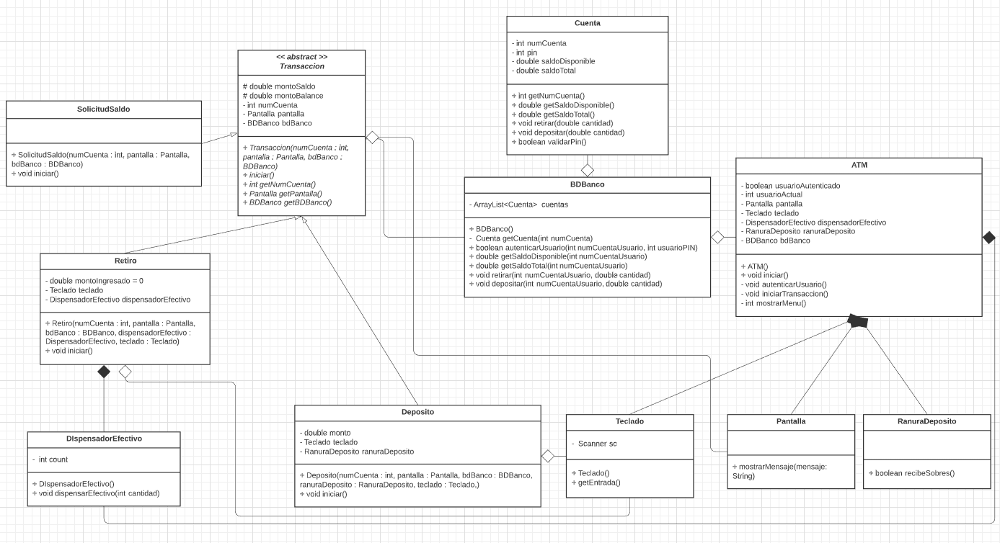

# TP Final Programación Avanzada

## Actividad

1. Analizar la [documentación de requerimientos](REQUERIMIENTO.md) a fin de determinar el alcance
del problema, objetos, clases y relaciones que permitan resolver el problema
de diseño.

2. Realizar el diagrama de casos de uso para modelar las interacciones entre los
clientes de un sistema (en este ejemplo práctico, los clientes del banco) y sus
casos de uso. El objetivo es mostrar los tipos de interacciones que tienen los
usuarios con un sistema sin proveer los detalles.

3. Realizar un diagrama de clases que permita modelar las clases en el sistema
que representa el funcionamiento de un cajero automático y sus
interrelaciones.

4. Mapear el diagrama de clases a código Java.

5. Se deberá hacer una investigación en la documentación del API de Java de la
clase Scanner para la lectura de datos a través de la entrada por teclado. Esto
nos permitirá que el usuario pueda interactuar con nuestra aplicación, por
ejemplo, eligiendo las opciones para depositar o retirar dinero.

### UML class

